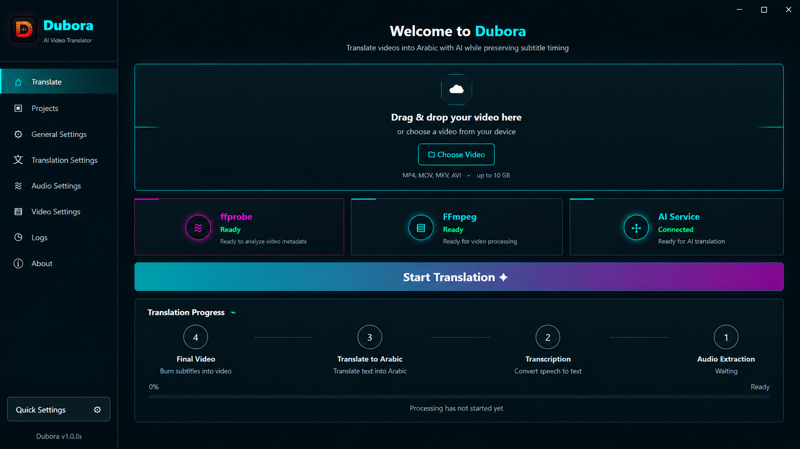

# Dubora

### AI-Powered Video Translation for Arabic

Dubora is a Windows desktop application that automates the process of translating videos into Arabic-subtitled versions using AI.

It combines audio extraction, speech transcription, contextual translation, subtitle validation, and final video rendering into one desktop workflow while preserving subtitle timing.



---

## Overview

Video translation normally requires several separate tools and manual steps.

Dubora brings the entire workflow into one application:

`Video` → `Audio Extraction` → `Speech Transcription` → `Arabic Translation` → `SRT Validation` → `Final Video`

The goal is to make AI-assisted video translation easier to manage while keeping subtitle timing and processing logic controlled locally.

---

## Key Features

- AI-powered speech transcription
- Context-aware Arabic subtitle translation
- Preserves subtitle timestamps
- Automatic audio extraction using FFmpeg
- Automatic subtitle rendering
- Long-video chunk processing
- Chunked translation requests
- Retry handling for failed requests
- Resume support for interrupted processing
- Cancelable processing
- Real-time processing progress
- Configurable translation chunk size
- Configurable transcription chunk length
- Configurable subtitle font and size
- Custom output directory
- Project history
- Processing logs for diagnostics
- Windows desktop interface
- Server-side AI gateway

---

## How It Works

### 1. Select a Video

The user selects a supported video file from the Dubora desktop interface.

Supported formats include:

- MP4
- MOV
- MKV
- AVI

### 2. Audio Extraction

Dubora uses FFmpeg to extract audio from the selected video.

### 3. Speech Transcription

The extracted audio is processed in chunks and sent to the transcription service.

### 4. Subtitle Generation

The transcription results are converted into structured subtitle blocks.

### 5. Contextual Arabic Translation

Subtitle text is sent to the AI translation service in controlled chunks.

Dubora keeps subtitle IDs and timestamps locally instead of allowing the AI model to control timing information.

### 6. SRT Validation

The application validates the translated subtitle structure before rendering.

### 7. Final Video Rendering

FFmpeg renders the translated Arabic subtitles into the final video.

---

## AI Gateway Architecture

Dubora uses a separate backend gateway instead of storing AI provider credentials inside the desktop application.

```text
Dubora Desktop Application
            │
            ▼
     Dubora AI Gateway
            │
            ▼
       AI Provider
```

The desktop application communicates with the gateway through HTTP requests.

The gateway handles AI transcription and translation requests while provider credentials remain on the server.

This architecture helps separate:

- Desktop application logic
- AI provider credentials
- Translation services
- Transcription services

It also makes it easier to change AI providers without redesigning the desktop application.

---

## Tech Stack

### Desktop Application

- Python
- PyWebView
- HTML
- CSS
- JavaScript

### Media Processing

- FFmpeg
- ffprobe

### Backend Gateway

- FastAPI
- Uvicorn
- REST API

### AI Services

- Groq API
- Whisper Large V3 Turbo
- Large Language Models for contextual translation

### Packaging & Development

- PyInstaller
- Inno Setup
- Git
- GitHub
- pytest

---

## Application Interface

Dubora uses a custom Cyber Teal desktop interface designed specifically for the application.

The interface includes dedicated sections for:

- Translate
- Projects
- General Settings
- Translation Settings
- Audio Settings
- Video Settings
- Logs
- About

The main Translate screen provides service status information for:

- AI Service
- FFmpeg
- ffprobe

It also displays the full processing workflow and live progress.

---

## Reliability

Long-running AI and video-processing workflows can fail for many reasons, including network errors, API failures, or interrupted processing.

Dubora includes several mechanisms designed to improve reliability:

- Audio chunking
- Translation chunking
- Request retry handling
- Translation fallback handling
- Resume state
- Cancellation support
- FFmpeg progress tracking
- SRT integrity validation
- Processing logs
- Persistent application settings

---

## Subtitle Timing Protection

One of Dubora's main design goals is protecting subtitle timing.

The AI model is responsible for translating subtitle text, but Dubora keeps subtitle identifiers and timestamps under local application control.

This reduces the risk of the AI model modifying timing information during translation.

---

## Security

AI provider credentials are not stored inside the distributed desktop application.

Provider secrets are configured on the backend server using environment variables.

Sensitive files are excluded from Git using `.gitignore`.

Files such as the following should never be committed:

```text
.env
.env.*
.venv/
.buildvenv/
logs/
temp/
```

Example environment files may be included only to document required server configuration.

---

## Project Structure

```text
Dubora/
│
├── app.py
│
├── gateway_url.txt
│
├── requirements.txt
│
├── requirements-dev.txt
│
├── pyproject.toml
│
├── pytest.ini
│
│
├── modules/
│   ├── audio_extractor.py
│   ├── gateway_client.py
│   ├── srt_utils.py
│   ├── video_burner.py
│   └── ...
│
├── ui/
│   ├── index.html
│   ├── style.css
│   ├── app.js
│   └── assets/
│
├── assets/
│   ├── dubora.ico
│   ├── dubora-logo.png
│   └── screenshots/
│       └── dubora-main.png
│
├── server/
│   ├── app.py
│   ├── providers/
│   └── requirements.txt
│
├── tests/
│
├── ffmpeg/
│   └── bin/
│
├── build_release.bat
├── build_setup.bat
└── Dubora_Setup.iss
```

---

## Running From Source

### Requirements

- Windows 10 or Windows 11
- Python 3.12+
- Internet connection for AI services

Clone the repository:

```bash
git clone https://github.com/hamzaomar-dev/Dubora.git
```

Enter the project directory:

```bash
cd Dubora
```

Create a virtual environment:

```bash
python -m venv .venv
```

Activate it:

```bash
.venv\Scripts\activate
```

Install the dependencies:

```bash
pip install -r requirements.txt
```

Run Dubora:

```bash
python app.py
```

---

## Building the Windows Application

Dubora can be packaged into a standalone Windows application using PyInstaller.

Run:

```bash
build_release.bat
```

The generated application is placed inside:

```text
dist/Dubora/
```

---

## Building the Windows Installer

Dubora uses Inno Setup to generate a Windows installer.

Run:

```bash
build_setup.bat
```

The installer can then be distributed as a standard Windows setup package.

---

## Testing

Install the development requirements:

```bash
pip install -r requirements-dev.txt
```

Run the automated tests:

```bash
pytest -q
```

The test suite covers important parts of the processing workflow and application logic.

---

## Current Release

### Dubora v1.0.0

Current target platform:

**Windows**

Current translation target:

**Arabic**

---

## Why I Built Dubora

Dubora was built as a complete software product rather than a single AI script.

The project combines several different development areas into one working application:

- Desktop application development
- AI API integration
- Backend API development
- Video and audio processing
- Subtitle processing
- Error handling
- Long-running task management
- Application state and resume logic
- Windows packaging
- Installer generation
- Testing and debugging

The development process focused on breaking the product into stages, implementing each stage, testing it, identifying failures, and iterating until the complete workflow worked end-to-end.

---

## Author

**Hamza Omar**

Computer Science Student  
AI-Assisted Product Builder

GitHub: [hamzaomar-dev](https://github.com/hamzaomar-dev)
